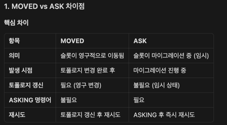

# Cluster

~~~
명령어: GET user:1000
  ↓
1. 키 추출: "user:1000"
  ↓
2. 슬롯 계산:
   SlotHash.getSlot("user:1000")
   → CRC16("user:1000") % 16384
   → 20026
  ↓
3. 노드 찾기:
   partitions.getMasterBySlot(20026)
   → slotCache[20026]
   → Node1 (마스터)
  ↓
4. 연결 가져오기:
   writers[20026] 확인
   ├─ 캐시 있음 → 기존 연결 재사용
   └─ 캐시 없음 → Node1에 새 연결 생성 후 캐시
  ↓
5. 명령어 전송:
   Node1 연결로 GET user:1000 전송
  ↓
6. 응답 수신:
   Node1에서 응답 반환명령어: GET user:1000
  ↓
1. 키 추출: "user:1000"
  ↓
2. 슬롯 계산:
   SlotHash.getSlot("user:1000")
   → CRC16("user:1000") % 16384
   → 20026
  ↓
3. 노드 찾기:
   partitions.getMasterBySlot(20026)
   → slotCache[20026]
   → Node1 (마스터)
  ↓
4. 연결 가져오기:
   writers[20026] 확인
   ├─ 캐시 있음 → 기존 연결 재사용
   └─ 캐시 없음 → Node1에 새 연결 생성 후 캐시
  ↓
5. 명령어 전송:
   Node1 연결로 GET user:1000 전송
  ↓
6. 응답 수신:
   Node1에서 응답 반환
~~~

## MOVED

처리 과정:
1. 잘못된 노드로 명령어 전송
2. Redis 서버가 MOVED 에러 반환 (올바른 노드 정보 포함)
3. Lettuce가 에러에서 올바른 노드 정보 추출
4. 올바른 노드로 명령어 재전송
5. 필요시 토폴로지 갱신

~~~
// cluster.c
void clusterRedirectClient(client *c, clusterNode *n, int hashslot, int error_code) {
    
    if (error_code == CLUSTER_REDIR_MOVED) {
        // MOVED 에러 형식: "MOVED <slot> <host>:<port>"
        int port = clusterNodeClientPort(n, shouldReturnTlsInfo());
        addReplyErrorSds(c, sdscatprintf(sdsempty(),
                                        "-MOVED %d %s:%d",
                                        hashslot, 
                                        clusterNodePreferredEndpoint(n), 
                                        port));
    }
}
~~~

## MOVED/ASK 리다이렉션

같은 슬롯의 키가 일부만 이동한 상태에서 토폴로지를 갱신하면 문제

~~~
// cluster.c
void clusterRedirectClient(client *c, clusterNode *n, int hashslot, int error_code) {
    
    if (error_code == CLUSTER_REDIR_MOVED) {
        // MOVED 형식: "-MOVED <slot> <host>:<port>"
        addReplyErrorSds(c, sdscatprintf(sdsempty(),
                                        "-MOVED %d %s:%d",
                                        hashslot, 
                                        clusterNodePreferredEndpoint(n), 
                                        port));
    } else if (error_code == CLUSTER_REDIR_ASK) {
        // ASK 형식: "-ASK <slot> <host>:<port>"
        addReplyErrorSds(c, sdscatprintf(sdsempty(),
                                        "-ASK %d %s:%d",
                                        hashslot,
                                        clusterNodePreferredEndpoint(n),
                                        port));
    }
}
~~~

### MOVED 리다이렉션 처리

~~~
상황:
  - 슬롯 5678이 Node1에서 Node2로 완전히 이동됨
  - Lettuce는 아직 Node1이 담당한다고 알고 있음

처리 과정:
1. Lettuce: GET user:1000 (슬롯 5678)
   → Node1로 전송

2. Node1: 슬롯 5678 확인
   → 자신의 슬롯 아님
   → MOVED 에러: "-MOVED 5678 192.168.1.20:6380"

3. Lettuce: MOVED 에러 감지
   → 에러 파싱: 슬롯 5678, 노드 192.168.1.20:6380
   → 토폴로지 갱신 트리거 (선택적)
   → Node2로 재전송

4. Node2: GET user:1000 처리
   → 정상 응답 반환
~~~

### ASK 리다이렉션 처리

~~~
상황:
  - 슬롯 5678이 Node1에서 Node2로 마이그레이션 중
  - Node1: MIGRATING 상태 (슬롯 5678을 보내는 중)
  - Node2: IMPORTING 상태 (슬롯 5678을 받는 중)
  - 키 "user:1000"은 아직 Node1에 있음
  - 키 "user:2000"은 이미 Node2로 이동됨

처리 과정:
1. Lettuce: GET user:2000 (슬롯 5678)
   → Node1로 전송 (아직 Node1이 담당)

2. Node1: 슬롯 5678 확인
   → MIGRATING 상태
   → 키 "user:2000" 없음 (이미 이동됨)
   → ASK 에러: "-ASK 5678 192.168.1.20:6380"

3. Lettuce: ASK 에러 감지
   → 에러 파싱: 슬롯 5678, 노드 192.168.1.20:6380
   → Node2로 연결
   → ASKING 명령어 먼저 전송
   → 그 다음 GET user:2000 전송

4. Node2: ASKING 확인
   → IMPORTING 상태이고 ASKING 플래그 있음
   → GET user:2000 처리 (임시로 처리)
   → 정상 응답 반환
~~~

### MIGRATING vs IMPORTING

슬롯 마이그레이션 = 이사

MIGRATING (이사 나가는 집)
→ 슬롯을 보내는 노드 (Source Node)
→ "나는 이 슬롯을 다른 노드로 보내고 있어"
→ 예: Node1이 슬롯 5678을 Node2로 보냄

IMPORTING (이사 들어오는 집)
→ 슬롯을 받는 노드 (Destination Node)
→ "나는 이 슬롯을 다른 노드로부터 받고 있어"
→ 예: Node2가 슬롯 5678을 Node1으로부터 받음

~~~
마이그레이션 과정:
1. Node2: CLUSTER SETSLOT 5678 IMPORTING <Node1-id>
   → Node2가 슬롯 5678을 IMPORTING 상태로 설정

2. Node1: CLUSTER SETSLOT 5678 MIGRATING <Node2-id>
   → Node1이 슬롯 5678을 MIGRATING 상태로 설정

3. 키 마이그레이션:
   → Node1에서 Node2로 키들을 MIGRATE

4. 마이그레이션 중 요청:
   - 키가 Node1에 있으면 → Node1이 처리
   - 키가 Node2로 이동했으면 → Node1이 ASK 리다이렉션
   - Node2는 ASKING 후 처리

5. 마이그레이션 완료:
   → Node2: CLUSTER SETSLOT 5678 NODE <Node2-id>
   → 이제 MOVED 리다이렉션으로 처리됨
~~~

흐름

~~~
클라이언트                    Node1 (MIGRATING)          Node2 (IMPORTING)
    |                              |                            |
    |  GET user:2000               |                            |
    |----------------------------->|                            |
    |                              |                            |
    |                              | 키 확인: 없음              |
    |                              | ASK 리다이렉션             |
    |  -ASK 5678 Node2             |                            |
    |<-----------------------------|                            |
    |                              |                            |
    |  Node2로 연결                |                            |
    |                              |                            |
    |  ASKING                      |                            |
    |---------------------------------------------------------->|
    |                              |                            |
    |                              | CLIENT_ASKING 플래그 설정  |
    |  OK                          |                            |
    |<----------------------------------------------------------|
    |                              |                            |
    |  GET user:2000               |                            |
    |---------------------------------------------------------->|
    |                              |                            |
    |                              | ASKING 플래그 확인 → 있음  |
    |                              | 키 확인 → 있음             |
    |  "value"                      |                            |
    |<----------------------------------------------------------|
~~~

## 토폴로지
토폴로지 (Topology) = 클러스터의 구조 정보

~~~
Redis Cluster 토폴로지:
  - 어떤 노드가 어떤 슬롯을 담당하는지
  - 각 노드의 정보 (IP, Port, Node ID)
  - 마스터-레플리카 관계
  - 노드의 상태 (UPSTREAM, REPLICA 등)

예시:
  슬롯 0-5460: Node1 (마스터)
  슬롯 5461-10922: Node2 (마스터)
  슬롯 10923-16383: Node3 (마스터)
  
  Node4: Node1의 레플리카
  Node5: Node2의 레플리카
  Node6: Node3의 레플리카
~~~

### 토폴로지 갱신 메커니즘

1. 노드 추가/제거
2. 슬롯 마이그레이션 완료
3. 페일오버 (마스터 장애 → 레플리카 승격)
4. 노드 IP/Port 변경
5. 레플리카 재배치

1) 주기적 갱신 (Periodic Refresh)
~~~
// ClusterTopologyRefreshScheduler.java
public void run() {
    // 주기적으로 토폴로지 갱신
    if (isEventLoopActive()) {
        clientResources.eventExecutorGroup()
            .submit(clusterTopologyRefreshTask);
    }
}

// 설정
ClusterClientOptions.builder()
    .topologyRefreshOptions(
        ClusterTopologyRefreshOptions.builder()
            .enablePeriodicRefresh(Duration.ofMinutes(30))  // 30분마다
            .build()
    )
    .build();
~~~
2) 적응형 갱신 (Adaptive Refresh)

~~~
// ClusterTopologyRefreshScheduler.java
@Override
public void onMovedRedirection() {
    // MOVED 리다이렉션 발생 시
    ClusterTopologyRefreshOptions options = 
        clientOptions.get().getTopologyRefreshOptions();
    
    if (options.getAdaptiveRefreshTriggers()
            .contains(RefreshTrigger.MOVED_REDIRECT)) {
        // 적응형 갱신 트리거
        indicateTopologyRefreshSignal();
    }
}

// 설정
ClusterTopologyRefreshOptions.builder()
    .enableAdaptiveRefreshTrigger(
        RefreshTrigger.MOVED_REDIRECT,      // MOVED 시
        RefreshTrigger.PERSISTENT_RECONNECTS // 재연결 시
    )
    .adaptiveRefreshTriggersTimeout(Duration.ofSeconds(30))
    .build();
~~~

전체 흐름

~~~
1. 토폴로지 갱신 트리거
   → 주기적 갱신 또는 적응형 갱신

2. 여러 노드에서 토폴로지 조회
   → CLUSTER SLOTS 명령어 실행
   → 여러 노드에 동시 요청 (병렬)

3. 토폴로지 파싱
   → 각 노드의 응답을 Partitions로 변환
   → 슬롯-노드 매핑 생성

4. 토폴로지 합의 (Consensus)
   → 여러 노드의 응답 중 선택
   → KnownMajority 또는 HealthyMajority 알고리즘

5. 캐시 업데이트
   → slotCache, masterCache 재구성
   → O(1) 조회를 위한 배열 업데이트

6. 연결 업데이트
   → 기존 연결에 새 토폴로지 반영
   → 새 노드 연결 생성 (필요 시)
~~~

### 합의 알고리즘

KnownMajority:
- 현재 알고 있는 노드 중 가장 많이 포함된 토폴로지 선택
- 안정성 우선

HealthyMajority:
- 활성(연결 가능) 노드 중 가장 많이 포함된 토폴로지 선택
- 최신성 우선

### reconnection

~~~
상황: 토폴로지가 아직 갱신 안 됨

1. ConnectionWatchdog: 재연결 시도
   → 기존 IP (192.168.1.10)로 연결
   → 실패 ❌

2. 재연결 실패 반복
   → attempt 1, 2, 3...

3. attempt >= 3 (기본값)
   → PERSISTENT_RECONNECTS 트리거
   → 토폴로지 갱신 시작

4. 토폴로지 갱신 완료
   → 새 IP 발견 (192.168.1.20)
   → updatePartitionsInConnections()
   → 기존 연결 닫기
   → 새 IP로 재연결 시도
   → 성공 ✅
~~~