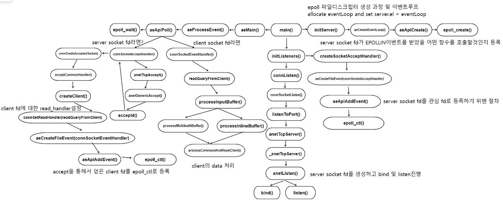

# EventLoop

이벤트 루프 = 무한 루프 + 이벤트 처리
- 파일 이벤트: 네트워크 I/O (클라이언트 연결, 데이터 수신/전송)
- 시간 이벤트: 타이머 (주기적 작업, 만료 키 삭제 등)
- 싱글 스레드로 모든 이벤트 처리

~~~
┌─────────────────────────────────────────────────┐
│ Redis 이벤트 루프 핵심                          │
├─────────────────────────────────────────────────┤
│ 1. 무한 루프 (aeMain)                           │
│    - stop 플래그가 1이 될 때까지 반복           │
│                                                 │
│ 2. 이벤트 처리 (aeProcessEvents)                │
│    - 파일 이벤트: 네트워크 I/O                  │
│    - 시간 이벤트: 주기적 작업                   │
│                                                 │
│ 3. 멀티플렉싱 API (epoll/kqueue/select)        │
│    - 여러 파일 디스크립터를 효율적으로 모니터링 │
│    - 이벤트 발생 시에만 깨어남                  │
│                                                 │
│ 4. 싱글 스레드 처리                             │
│    - 모든 이벤트를 순차적으로 처리              │
│    - 블로킹 없이 빠른 응답                      │
└─────────────────────────────────────────────────┘
~~~

## Process
~~~
┌─────────────────────────────────────────┐
│ aeMain() 시작                           │
└─────────────────────────────────────────┘
              ↓
┌─────────────────────────────────────────┐
│ while (!stop) {                         │
│   aeProcessEvents()                     │
│ }                                       │
└─────────────────────────────────────────┘
              ↓
┌─────────────────────────────────────────┐
│ 1. beforeSleep() 호출                   │
│    - AOF 플러시                         │
│    - 클라이언트 응답 전송               │
│    - 만료 키 삭제                       │
└─────────────────────────────────────────┘
              ↓
┌─────────────────────────────────────────┐
│ 2. 타임아웃 계산                        │
│    - 다음 시간 이벤트까지 남은 시간      │
│    - 없으면 NULL (무한 대기)            │
└─────────────────────────────────────────┘
              ↓
┌─────────────────────────────────────────┐
│ 3. aeApiPoll() 호출 (블로킹!)           │
│    - epoll_wait() / kevent() / select() │
│    - 이벤트 발생할 때까지 대기          │
│    - 타임아웃 또는 이벤트 발생 시 반환   │
└─────────────────────────────────────────┘
              ↓
┌─────────────────────────────────────────┐
│ 4. afterSleep() 호출                    │
│    - 모듈 GIL 획득                      │
└─────────────────────────────────────────┘
              ↓
┌─────────────────────────────────────────┐
│ 5. 파일 이벤트 처리                     │
│    - 읽기: readQueryFromClient()        │
│    - 쓰기: sendReplyToClient()          │
└─────────────────────────────────────────┘
              ↓
┌─────────────────────────────────────────┐
│ 6. 시간 이벤트 처리                     │
│    - serverCron() (주기적 작업)         │
└─────────────────────────────────────────┘
              ↓
        (다시 1단계로)
~~~

- aeApiPoll()이 Sleep을 수행

## aeEventLoop

~~~
// ae.h
typedef struct aeEventLoop {
    int maxfd;                    // 현재 등록된 최대 파일 디스크립터
    int setsize;                  // 최대 파일 디스크립터 수
    long long timeEventNextId;    // 다음 시간 이벤트 ID
    int nevents;                  // 등록된 이벤트 배열 크기
    
    aeFileEvent *events;          // 등록된 파일 이벤트 배열
    aeFiredEvent *fired;          // 발생한 이벤트 배열
    
    aeTimeEvent *timeEventHead;   // 시간 이벤트 연결 리스트 (헤드)
    
    int stop;                     // 루프 종료 플래그
    void *apidata;                // 멀티플렉싱 API 데이터 (epoll/kqueue/select)
    
    aeBeforeSleepProc *beforesleep;  // sleep 전 콜백
    aeBeforeSleepProc *aftersleep;   // sleep 후 콜백
    
    int flags;                    // 플래그 (AE_DONT_WAIT 등)
} aeEventLoop;
~~~

## Reference
- https://gutte.tistory.com/153